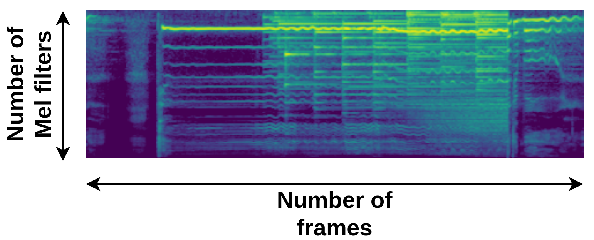

# Explanation

The following section details the process followed for collecting spectrogram samples, explaining the reasons for selecting certain parameters.

## Processing

The parameter `N_MELS` in a Mel spectrogram refers to the number of Mel filters used in its creation. A Mel spectrogram is a visual representation of an audio signal transformed to the Mel scale, which is a logarithmic transformation of the frequency of a signal. This scale mimics human perception of sound.

The transformation from Hertz to the Mel scale is expressed by the following equation:

$$
m = 2410 \cdot \log_{10} \left(1 + \frac{f}{625}\right),
$$

where `m` is the frequency in Mels and `f` is the frequency in Hertz.

In a Mel spectrogram, the audio signal is divided into small time windows. For each window, the Fast Fourier Transform (FFT) is calculated. A Mel filter bank (determined by `N_MELS`) is then applied to the FFT output, resulting in a spectrogram where the y-axis is on the Mel scale instead of the frequency scale.

`N_MELS` determines the number of frequency bands considered in the Mel spectrogram. A higher value of `N_MELS` provides greater frequency resolution but also increases computational complexity.

In a Mel spectrogram, the height of the spectrogram (number of rows) corresponds to the number of Mel filters used. Each Mel filter captures the energy in a particular frequency band, so each row of the spectrogram represents the energy in a different frequency band. A higher value of `N_MELS` results in a spectrogram with more rows and higher frequency resolution, but it also increases computational complexity. It is crucial to balance frequency resolution and computational efficiency when choosing `N_MELS`.

$$
\text{Number of frames} = \frac{\text{Sampling Rate} \times \text{Duration}}{\text{Hop Length}}.
$$

The sampling rate of 22050 Hz is frequently used because it is sufficient to capture most of the frequencies audible to the human ear. It is used because the Mel scale considers the logarithmic perception of sound, and this rate remains adequate for most applications without sacrificing perceived quality.

The `hop length` refers to the number of samples between successive windows when applying a Fourier transform to an audio signal. A `hop length` of 512, for example, means that the next window starts halfway through the current window. This affects the temporal resolution of the analysis: a smaller `hop length` provides higher temporal resolution at the cost of increased computational complexity, while a larger `hop length` reduces temporal resolution but is computationally cheaper.

A value of `N_MELS` of 128 is common in audio signal processing. The choice of 128 as the number of Mel filters is based on a balance between frequency resolution and computational efficiency. The Mel scale was designed to mimic human perception of sound, which discriminates more finely between lower frequencies than higher frequencies. Therefore, having more Mel bands allows greater resolution in the lower frequencies, where the human ear is more sensitive. However, increasing the number of Mel bands also increases the computational complexity of calculating the Mel spectrogram. In practice, 128 Mel bands often provide a good balance for many applications.

To process spectrograms using machine learning algorithms, it is convenient for them to have a square shape (same number of pixels in height and width). If a duration of 10 seconds is set, the following is obtained:

$$
\text{Number of frames} = \frac{\text{Sampling Rate} \times \text{Duration}}{\text{Hop Length}} = \frac{22050 \, \text{samples/s} \times 10 \, \text{s}}{512 \, \text{samples}} = 431.
$$

Dividing 431 by 128 yields approximately 3.37 possible divisions of a spectrogram of 128 pixels high by 128 pixels wide, with minimal loss of information. This is useful for applying data augmentation techniques, obtaining 3 possible divisions of a 128 by 431 spectrogram, which will be obtained randomly during training.

For inference, the minimum duration required to obtain 128 by 128 spectrograms can be calculated:

$$
\text{Duration} = \frac{\text{Number of frames} \times \text{Hop Length}}{\text{Sampling Rate}} = \frac{128 \times 512 \, \text{samples}}{22050 \, \text{samples/s}} = 2.9722 \, \text{s}.
$$

Therefore, for inference, 3 seconds of audio are taken to convert them into a 128 by 128 spectrogram, with which predictions are made. However, in this case, at least 9 seconds will be analyzed, obtaining 3 spectrograms. Classification is performed on each of them to obtain a probability vector for each one, which are then combined using the product, and subsequently normalized to obtain the final prediction.